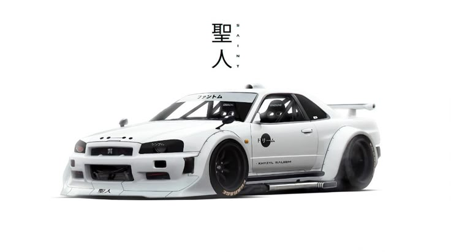

<h1 align="center">Hi, I'm Youssef Bahloul 👋</h1>
<h3 align="center">I’m a passionate Web Developer & Tech Explorer from Morocco 🇲🇦</h3>

      
       
      

<h2 align="left">Who am I </h2>

- 💻 I’m a **full-stack web developer** with a strong focus on clean code & creative UI/UX.
- 🚀 I build digital experiences and tools that are fast, elegant, and user-focused.
- 🧠 I love learning new technologies and optimizing workflows.
- 📫 How to reach me: **youssef.bahloul.dev@gmail.com**
- 📄 Know more about me on [LinkedIn](https://www.linkedin.com/in/youssef-bahloul)
- ✨ Fun Fact: **I debug faster than I run 🐛💨**

<h2 align="center">My Ventures & Projects 💼</h2>

- 👕 Founder: **RC Racing Apparel**
- 💻 Developer: **Freelance Web Solutions**
- 🔧 Project Contributor: **Open-source & startup tech tools**
- 🚀 Soon launching something exciting... stay tuned!

<h2 align="center"> Let's Connect </h2>

    
    
    
    

 

<h3 align="left">Languages and Tools I Love 💻</h3>

 
   
   
   
   
  
  
  

 

<h3 align="center">"Code is how I race through reality ⚡"</h3>
